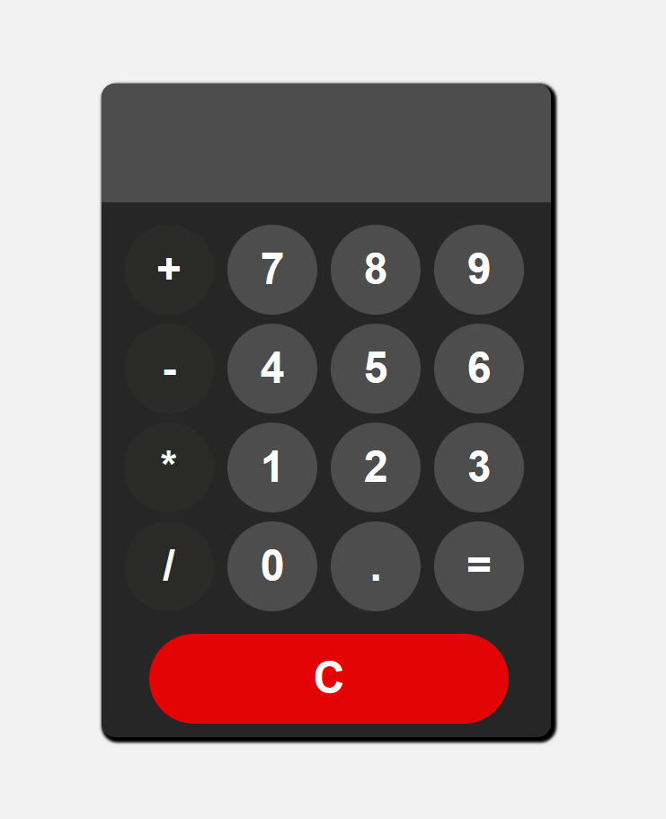

# CodSoft Internship

<b>LEVEL1 :</b>

<b>Task3: Calculator</b>

I have created a basic calculator using HTML CSS and JavaScript.
I have implemented an interactive interface with buttons for addition, subtraction, multiplication, and division
operations. The calculator has a display screen to show user input and results. I have utilized
CSS grid system for button alignments and used event listeners, if-else statements, operators, and
loops to handle user input and perform calculations.
Screenshots for the Calculator:

<i>Caption: Calculator</i>
